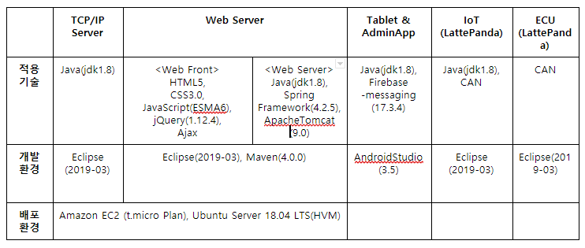
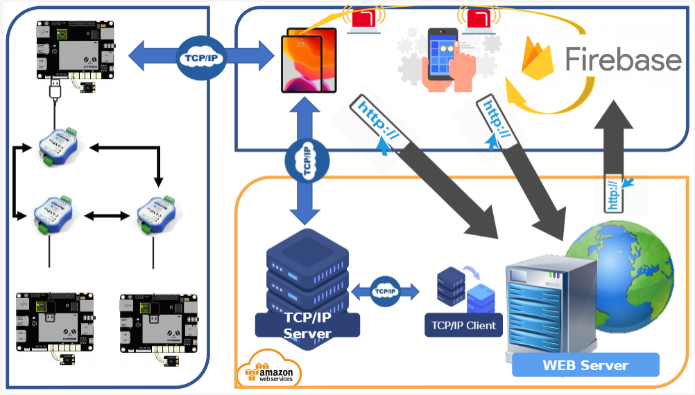
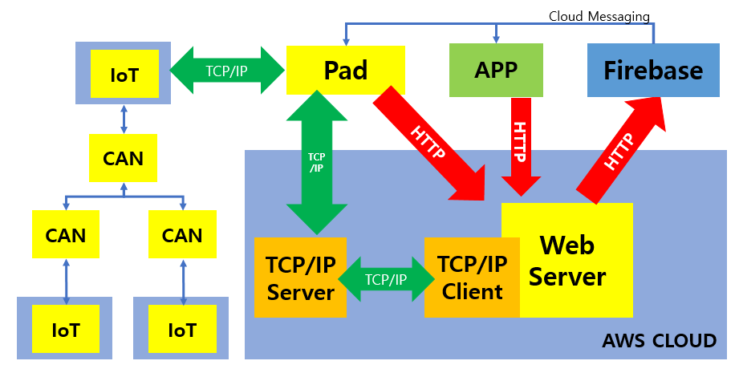

# CAN을 이용한 커넥티드카 통신 기반 시스템 구축
> 멀티캠퍼스 Hexacore 팀 : 강동욱 김연주 백대현 이슬 전국현 최여진

## 1. 프로젝트 개요
> 커넥티드카 통신 구축 및 차량 환경변수 실시간 모니터링, 제어 시스템 개발

## 2. 프로젝트 환경



## 3. 시스템 구성도  





## 4. 기능 구현
### 1) AdminApp
- 제어할 PAD 의 ID ,PAD 에 연결된 ECU 의 ID, 제어자 (0/1) 을 입력받는다.
- 제어자가 0/1 일 때만 SEND버튼을 누르면 HTTP 통신을 통해 Web Server 에 접속하고 입력받은 Data 를 전송한다.
- 0/1 이 아닌 제어자를 입력하고 SEND 버튼을 누르면 ‘유효한 Controller를 입력해 주세요’ ’Toast 메시지가 뜬다.

### 2) Web Server
- Pad 로 부터 Data 받기
a. PAD에서 HTTP통신을 통해 각 ECU 들의 Data를 Controller 에서 받는다.
b. 받을 때마다 Firebase Cloud Messaging 기능을 통해 App 으로 받은 Data 를 전송한다.
c. 화면에서 ‘Receive from Pad’ 버튼을 누르면 Ajax 를 이용해 받은 ECU들의 Data 를 1초 간격으로 요청한다. 
d. success 시 PAD의 ID, ECU의 ID, ECU ID 에 맞는 Data 를 화면에 display 한다.
- Browser/App 를 이용한 ECU 제어
a. 입력받은 PAD 의 ID, ECU 의 ID, 제어자 (0/1) 을  Msg 객체에 담아 TCP/IP 서버로 전송한다.
b. 입력받은 PAD 의 ID, ECU 의 ID, 제어자 (0/1) 을 Firebase Cloud Messaging 기능을 통해 PAD 로 전송한다.
- AWS 에 Spring 프로젝트를 배포하여 http://13.209.113.212:8080/AdminWeb/ 로 웹에 접속할 수 있다. 

### 3) TCP/IP Server
- Web Server와 통신
Web Server에서 Send 버튼을 누르면 Receiver Thread 내에서 TCP/IP Socket 통신으로 Web Server 와 연결된다. Web Server에서 받은 PAD ID,ECU ID와 제어자값을 msg 객체에 담아 TabServer에 전송하는 전달자의 역할을 수행한다. 사전에 HashMap객체에 담긴 TabServer정보를 바탕으로 제어하고자하는 TabServer의 IP가 HashMap 객체에 존재하지 않으면 msg 객체를 전송하지 않는다. 
- TabServer와의 통신
서비스를 제공해야 할 여러대의 TabServer를 관리한다. TabServer는 Local Client들에게는 Server역할을 하지만 TCP/IP Server에게는 Client 역할이 된다. 실제 구현 시에는 TabServer의 개수는 수십에서 수백개 정도 늘어날 것이며 해당하는 TabServer의 연결 정보를 TCP/IP Server에서 관리한다. HashMap<TabServerId,ObjectOutputStream>객체에 담아서 관리를 수행한다.

### 4) TapServer
- PAD 는 ConnectThread를 통해 HTTP통신으로 WebServer와 접속한다.
- PAD 는 RecieverThread에서 각 ECU 들의 data 를 받을 때마다 HTTP통신을 통해 WebServer로 전송한다.  
- START를 누르면 msg객체의 txt요소에 1을 담아 IoT로 보낸다.
- STOP을 누르면 msg객체의 txt요소에 0을 담아 IoT로 보낸다.

### 5) Network Client - CAN통신을 활용한 기능별 Device를 제어
- Pad Server와 CAN Network통신을 구현
- Device에서 측정된 RPM, 습도,온도 데이터가 CAN네트워크를 데이터를 전송
- CAN네트워크에서 공유된 데이터를 Server LattePanda에서 TCP/IP 통신을 통해서 Pad에게 값을 전송
- Pad Server에서 실시간으로 올라오는 값을 확인
- Pad Server에서는 전체 Device를 Start/Stop 가능
- Pad Server에서는 특정 Device를 Start/Stop 가능


## 제작자

- 강동욱 
- 김연주
- 백대현 
- 이슬 
  - Mail : seulee95@naver.com
  - Github : https://github.com/QuartzzBlue
- 전국현 
- 최여진
  - Mail : who3637@naver.com
  - Github : https://github.com/yeojini

---
<주의>
- \Hexacore\tabserver\app\src\main\AndroidManifest.xml 파일에
```
android:usesCleartextTraffic="true"
```

추가해야 안드로이드 9.0 이상에서 작동합니다.
- Firebase 를 위한 서버키값/기기토큰값 설정 필요
- App,Pad 에서 Http통신을 위해 WebServer 의 IP 설정 필요
- Pad 에서 TCP/IP 통신을 위해 TCP/IP Server 의 IP 설정 필요

---

- **git을 활용한 프로젝트 관리** (git 에 `push` 할 때 주의할 점)​

✔️ git bash 접속해서 `git pull`을 먼저하기

✔️ `master` 권한으로 올리지 않기 → `branch` 생성해서 `push` 하기

✔️ `branch` 이름은 자신이 맡은 역할을 나타낼 수 있도록 만듦

> 오늘 calendar 작업을 했으면, branch 이름은 calendar

> commit message에 날짜와 함께 작업 내용 상세하게 기록해주세요 😄

    git branch 브랜치명 → branch 생성
    git branch → 현재 접속 된 branch 확인
    git checkout 브랜치명 → 해당하는 branch로 접속
    
    git push origin 브랜치명
    → 접속된 `branch`로 push 하는 법 (저장소 이름인 'origin' 뒤에 branch 이름 써서 push 하기)
